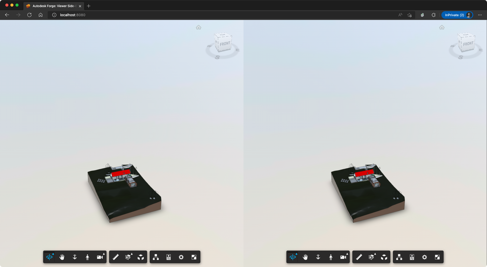

# forge-viewer-side-by-side-nodejs

This sample demonstrate how to sync camera between two viewer instances. 

## Development

### Prerequisites

- [Forge application](https://forge.autodesk.com/en/docs/oauth/v2/tutorials/create-app)
- [Node.js](https://nodejs.org) (we recommend the Long Term Support version)
- Terminal (for example, [Windows Command Prompt](https://en.wikipedia.org/wiki/Cmd.exe)
or [macOS Terminal](https://support.apple.com/guide/terminal/welcome/mac))

### Setup & Run

- Clone this repository
- Install dependencies: `yarn install` or `npm install`
- Setup environment variables:
  - `FORGE_CLIENT_ID` - your Forge application client ID
  - `FORGE_CLIENT_SECRET` - your Forge application client secret
  - `FORGE_BUCKET` (optional) - name of Forge bucket to store your designs in
- Run the server: `npm start`

> When using [Visual Studio Code](https://code.visualstudio.com),
you can specify the env. variables listed above in a _.env_ file in this
folder, and run & debug the application directly from the editor.

## Troubleshooting

Please contact us via https://forge.autodesk.com/en/support/get-help.

## License

This sample is licensed under the terms of the [MIT License](http://opensource.org/licenses/MIT).
Please see the [LICENSE](LICENSE) file for more details.

## Written by

Eason Kang [@yiskang](https://twitter.com/yiskang), [Forge Partner Development](http://forge.autodesk.com)